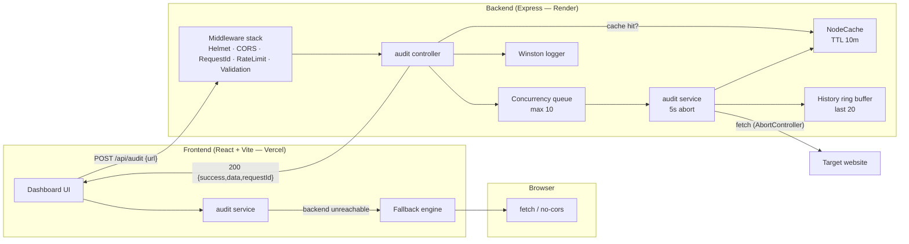
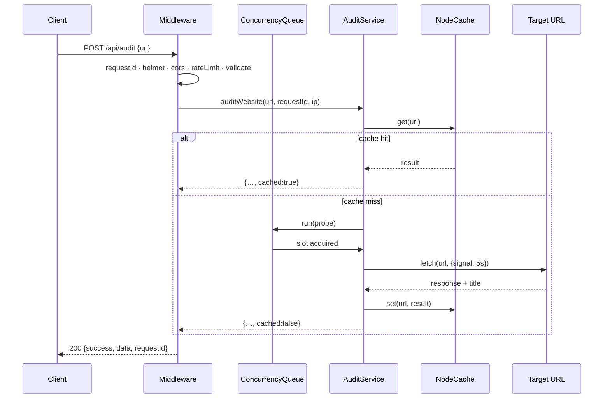

# Architecture

## Component diagram

## Request lifecycle

## Layers

| Layer | Responsibility | Key files |
| --- | --- | --- |
| Transport | HTTP server, CORS, security headers | `app.ts` |
| Middleware | Request ID, rate limit, validation, errors | `middlewares/` |
| Controller | Request/response shaping, orchestration | `controllers/` |
| Service | Cache, queue, probe, history, logging | `services/` |
| Utils | Errors, validation schema, logger | `utils/` |
| Config | Env parsing, constants | `config/` |

## Key invariants

1. **Every response carries a `requestId`** — success or error.
2. **Errors always use the `{success:false,error,requestId}` envelope.**
3. **Only reachable results are cached** — transient failures are not
   remembered as "the answer".
4. **Cache TTL is env-configurable**, defaulting to 10 minutes.
5. **Concurrency is bounded** at `MAX_CONCURRENT_AUDITS` (default 10);
   excess work queues fairly (FIFO).
